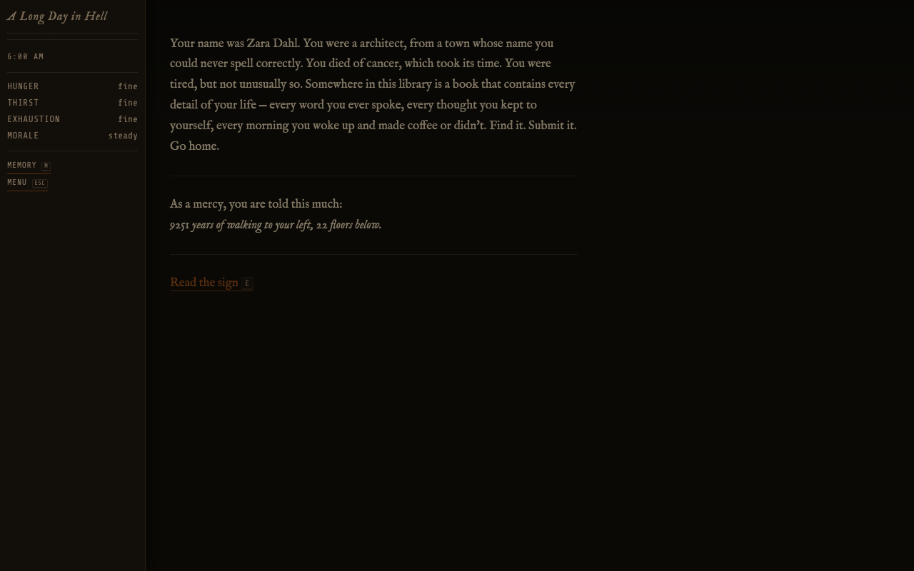
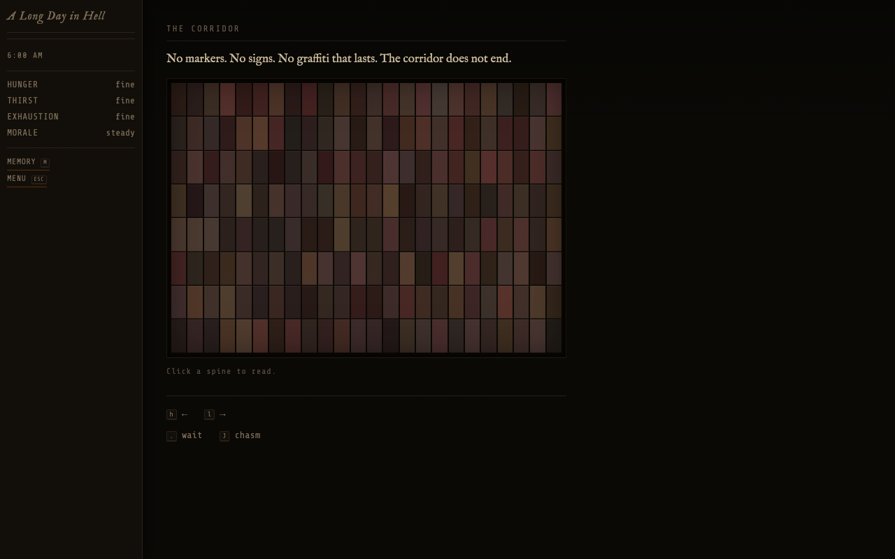
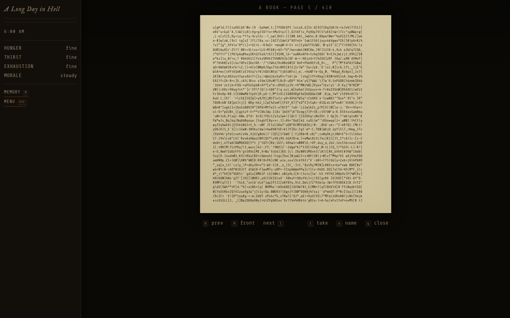
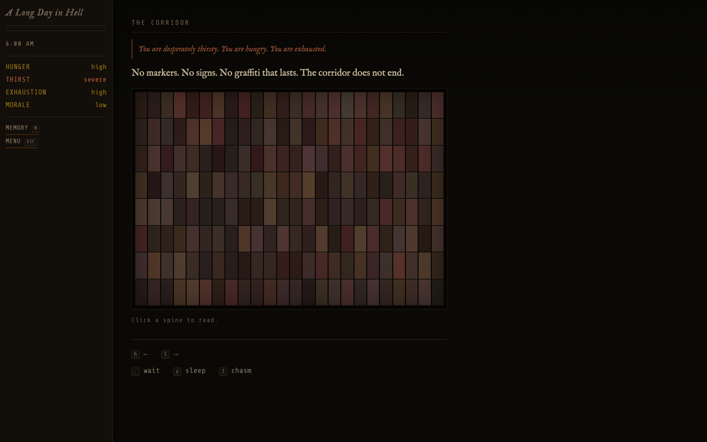
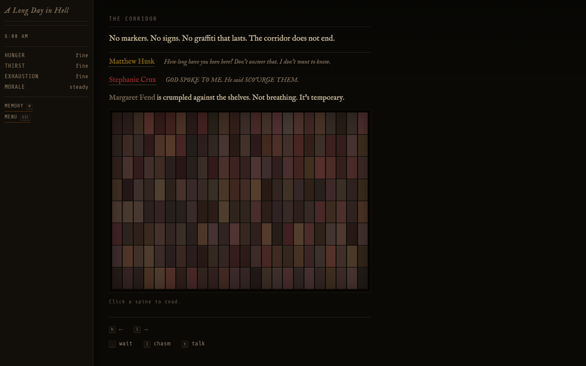
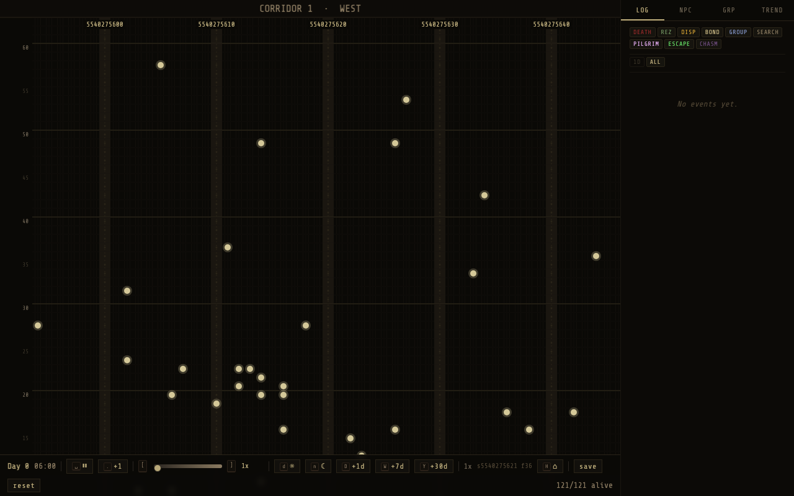

# A Long Day in Hell

A 7DRL (7-Day Roguelike) based on the novella *A Short Stay in Hell* by Steven L. Peck, itself inspired by Borges' *The Library of Babel*.

You are a condemned soul in a Hell that takes the form of an impossibly vast library. Your only way out: find the one book that perfectly describes your life. As a small act of mercy, your particular book has been placed within the bounds of computability.



## Play

Open `dist/index.html` in a browser. Single self-contained HTML file, no server needed.

Or build from source:

```bash
bash build.sh          # esbuild bundles .ts directly → dist/index.html
npm test               # fast logic tests (~2s, ~1290 tests)
npm run test:dom       # DOM integration tests (~7s, ~360 tests)
npm run test:all       # everything incl. slow sims (~1830 tests)
```

Requires Node.js 25+ (native type stripping). No tsc build step — `tsconfig.json` is `noEmit: true`, type-check only.

## The Library

Two parallel corridors (west and east) separated by a chasm. Each corridor is divided into segments of 17 galleries — 16 shelving galleries of 200 books each (25 columns × 8 shelves) and one kiosk gallery. Rest areas at every segment boundary: clock, kiosk, 7-bed bedroom, bathroom, submission slot, and stairs.



Books are 410 pages, 40 lines of 80 characters (1,312,000 characters), drawn from ~95 printable ASCII characters. Every book is procedurally generated from the global seed + shelf coordinates. Almost all are random noise. Your book — and only your book — contains readable prose.



## Survival

Hunger, thirst, exhaustion, morale. Kiosks provide food and drink at every rest area. Sleep in bedrooms. Death from deprivation is possible — but temporary. You die, you come back at dawn. Same location. There is no escape through death.



## NPCs

120 characters spawned in waves across both corridors. ECS-driven social physics: psychology decay over cosmic timescales, personality-driven compatibility, relationship bonds, group formation and dissolution, habituation to trauma. NPCs wander, deteriorate, form bonds, go mad, die, and come back.

You can talk to them, spend time together, invite them to travel with you. Companions follow your lead, share a home rest area, and slow each other's psychological decay. But incompatible personalities erode — groups self-dissolve when familiarity breeds contempt.



## Core Systems

- **Navigation**: Move between galleries and segments. Climb stairs between floors. Cross the chasm at floor 0 only.
- **Psychology**: Lucidity and hope degrade over cosmic timescales. Low lucidity → madness. Low hope → catatonia. Personality traits bias the direction you break.
- **Events**: Stochastic event deck drawn on movement — environmental, existential, and mechanical encounters with morale effects.
- **Groups**: Recruit companions. Leaders determine movement direction. Group members follow closely (80–98% bias). Shared home rest areas align through co-sleeping.
- **Chasm**: Jumping is not suicide — you tumble endlessly, dying and resurrecting mid-freefall, until you catch a railing. The worst thing to witness.
- **Win Condition**: Find your book and submit it at a submission slot.

## Is it possible to win?

Yes — in principle. Here's how the book's location is determined.

### Book coordinates from life story text

Every soul's life story text is treated as a number in base 95 (the library's character set). This is the *raw address* — an astronomically large integer encoding the unique content of that life.

Book coordinates are then derived as:

```
bookAddress = rawAddress(soul) - rawAddress(player) + playerBookAddress
```

`playerBookAddress` is a seed-derived constant chosen at world generation, drawn from `[0, PLAYABLE_ADDRESS_MAX]`. For the player, the subtraction cancels exactly — `bookAddress = playerBookAddress` — which is always within the navigable space by construction. The player's book exists somewhere in this library. You *can* win.

For NPCs, the subtraction of two independently generated large numbers usually produces a result that is itself enormous — far beyond the library's coordinate space. Their book doesn't exist here. They are damned.

### Why?

The navigable library has `PLAYABLE_ADDRESS_MAX = 10,000,000,000 × 2 × 100,000 × 192 ≈ 3.84 × 10^17` locations. A life story of ~1,000 characters interpreted in base 95 produces a number around 95^1000 ≈ 10^1970. The coordinate system is anchored to the player's own raw address so the player's offset is always zero, and `playerBookAddress` is small enough to keep the result within the playable address range. The player's book always lands somewhere walkable.

## Controls

| Key | Action |
|-----|--------|
| `h` `l` / ← → | Move left / right (flip pages in book view) |
| `k` `j` / ↑ ↓ | Move up / down stairs |
| `x` | Cross chasm (floor 0 only) |
| `b` | Enter bedroom |
| `z` | Sleep |
| `.` | Wait |
| `t` | Talk to NPC / take book from shelf |
| `r` | Read held book |
| `p` | Put book back |
| `n` | Name a book |
| `i` | Invite NPC to travel together |
| `d` | Dismiss companion |
| `J` | Jump into chasm |
| `K` | Kiosk |
| `s` | Submission slot |
| `Esc` / `q` | Back / close |

## Godmode

`?godmode=1` — observation mode. Vertical corridor map (position × floor), NPC dots colored by disposition, click-to-follow, zoom/drag/pan. Toggle between west and east corridors with Tab. Side panel with full ECS component inspection, event log with filters, group view, trend graphs. Possess any NPC. Step time forward at any speed.



## Architecture

```
lib/                    # Pure logic (34 TS modules, no DOM)
  *.core.ts             # prng, library, book, survival, tick, events, npc,
                        # ecs, social, personality, psych, belief, movement,
                        # needs, chasm, despairing, lifestory, invertible...
scripts/
  build-bundle.js       # esbuild bundles lib/*.core.ts → IIFE
  build-vanilla.js      # Merges content + CSS + JS → dist/index.html
content/
  *.json                # All prose, events, NPCs, screens, life stories, stats
src/
  js/                   # Browser wrappers + engine + screens + input + godmode
  css/                  # style.css + godmode.css (inlined at build)
test/
  *.test.js             # node:test suites (~1830 tests)
```

Pure game logic lives in `lib/`. Browser wiring lives in `src/js/`. All prose and content lives in `content/*.json`.

## License

Do whatever, credit me.
